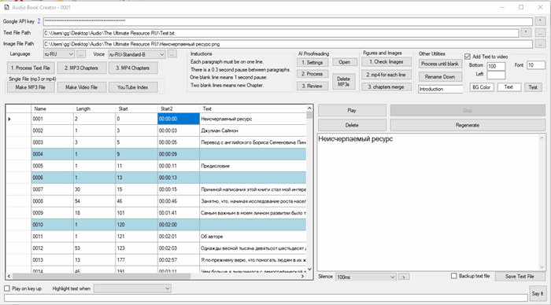

This application lets you create an audio book using Google TTS API. The application will generate mp3 file for each paragraph and then merge them together.

Originally posted here:
<https://www.codeproject.com/Articles/5385823/Google-Audio-Book-Creator/>

## Introduction
This application lets you create an audio book using Google Text-to-Speech AI API. The application will generate mp3 file for each paragraph and then merge them together.  The Google Text-to-Speech AI is $16 per 1 million characters. First 1 million characters FREE.  An average 200 page audiobook is about 0.2 million characters.  Which means that you can create 5 audiobooks a month for free. 

In contrast, OpenAI Text-to-Speech API is $30.00 per million characters.  And Eleven Labs is $99 per half a million characters.

In addition Google Text-to-Speech lets you specify the language and the speech in non-English language is without accent.  In contrast, OpenAI and Eleven Labs have bad foreign accent for non-English languages.

If you have a pdf file, the text file needs to be generated by opening the pdf file in Word and copied and pasted to a text file. Open the text file in a text editor that has line numbers such as Notepad2. Open the file in and remove text that would not be read like: table of contents, footnotes, index and references. Each paragraph must be on one line.  The Application has AI Proofreading section so this work can be automated by using OpenAI or Anthropic.

There is a 0.3 second pause between paragraphs. One blank line means 1 second pause. Two blank lines means new Chapter.

One blank line means 1 second pause. But you can use the “Silence” feature to customize the pause duration.



Background
This article is a sequel to two my other articles I wrote about creating AI  audiobooks using Eleven Labs and OpenAI TTS.

## How to Create an Audiobook
- First get API Key from Google
-- Create a project (or use an existing one) in the Cloud Console.
-- Make sure that billing is enabled for your project.
-- Enable the Text-to-Speech API.
- Create an API key.
- Select Language and Voice. 
- “Say it” will generate mp3 file based on any text and place the file into Temp folder in the same folder as the EXE.
- “Highlight text when” option helps you with text file correction and editing before to generate the mp3 files. For example, “Begins with lower case character” and “Begins with a number” option will highlight paragraphs that might be broken during Word PDF conversion. “Contains number” might help identify paragraphs that contain a footnote number.
- “Save text file” saved the changes in the text file. “Backup text file” option creates a backup to let you undo the changes you made to the text file. The backup text files will be placed in the folder with the same name as the text file name plus “_backup”.
- “1. Process Text File” will generate MP3 file for each line in the text file. The file will be placed in the folder with the same name as the text file name. Each file will be named after the line number in the text file like 0001.mp3. This means that you should not add or delete lines to the text file after MP3 files are generated.
- Select a line in the grid and click Play to play an MP3 file. Click Stop to stop the mp3 file playing. Select a line in the grid and click Delete to delete an MP3 file.
- You can delete bad mp3 files and click 1. Process Text File again to regenerate the mp3 files that were deleted.
- You can also select a line in the grid and click Regenerate to re-create the MP3 file. This option will also save the text file if needed.
- Play on key up option allows you to listen to the entire book by pressing the arrow down key after selecting a line text.
- Once you are satisfied with the quality of the generated mp3 files, click 2. MP3 Chapters to generate mp3 file for each chapter. Two blank lines in the text file means new Chapter. The files will be placed in the folder with the same name as the text file name plus -Chapters.
- Merge MP3 Chapter files into one mp3 file. The mp3 file will be placed in the folder as the text file and have the same name but with mp3 extension.

To add figure image file for each paraph:

- Create an "images" folder.  This will show "Figures" panel  on the form.  
- Create "Figure" folder inside of the "images" folder. Place image files like: 1-1.png.
- If any paragraph text will reference "Figure 1-1", it will include 1-1.png in the video file. 
- Create "Table" folder inside of the "images" folder.   Place image files like: 1-1.png.
- If any paragraph text will reference "Table 1-1", it will include 1-1.png in the video file.

## Uploading Audiobook to YouTube
- First select Image file to be used for mp4 file generation.
- 3. Make MP4 Files will generate mp4 file for each chapter. This operation uses mp3 files from -Chapters folder. This operation can take about 8 hours. These files can then be uploaded to YouTube. The files will be placed in the folder with the same name as the text file name plus -Videos
- Make Video File will generate one mp4 file. These files can then be uploaded to YouTube. The file will be generated by merging MP4 chapter files if they are available. MP4 chapter files are not available. The single mp3 file will be used, but the operation can take about 8 hours. The MP4 file will be placed in the folder as the text file and have the same name but with mp4 extension.
- Generate YouTube index from Chapters mp3 file duration. The index can be used in the Video description or the comment section. Note that MP4 files night be generated with a different duration so the Index might need to be adjusted.

Here is an audiobook I created using this app.

## Using the code
Code is using ffmpeg.exe to convert mp3 to mp4 and change mp3 bitrate.  

## Points of Interest
Creating a Text document out of PDF can be vary time consuming. I am planning to create another project that would do so by using OpenAI Vision API.  For now the best way is to upload your PDF file to Google Drive.  Google will automatically OCR it for you.  Next use AutoHotkey  convert the PDF to text so that each paragraph is a line of text.  For example, by using this AutoHotkey code below you can highlight a  paragraph in PDF file and press Windows Key.  AutoHotkey will append the text to your Text file.

```
#Persistent
#SingleInstance Force
; Define the hotkey Ctrl + Shift + C
~LWin::
    Clipboard := ""
    Send, ^c
    ClipWait, 4
    selectedText := Clipboard
    StringReplace, selectedText, selectedText, `r`n, %A_Space%, All
    StringReplace, selectedText, selectedText, `n, %A_Space%, All
    StringReplace, selectedText, selectedText, `t, %A_Space%, All
    filePath := "C:\Audio\Test.txt"
    FileAppend, %selectedText%`r`n, %filePath%, UTF-8
return
```
